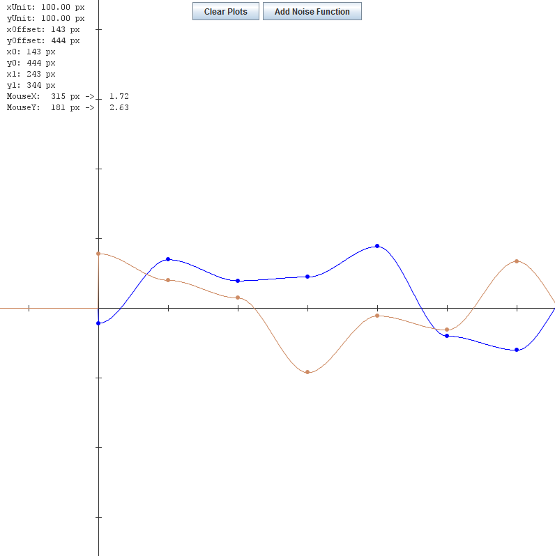

# AwfulPlotter
An awful plotter nobody should use



## Features

* No optimization
* Awful text display
* ~~Hardcoded default size~~
* See those dots? Good luck plotting them for your own functions
* No build system support or anything
* Outdated screenshot by first release

## Usage

Example code usage is found in `Main`, it is as simple as

```
AwfulPlotter plotter = new AwfulPlotter();
plotter.plot((x) -> x*x);
```
(when you ignore the UI code)

### Controls

* Left-click and drag to move around
* Double left-click to return to origin
* Scroll wheel to zoom in and out (on the mouse cursor)
* Shift + Scroll wheel zooms vertically
* Ctrl + Scroll wheel zooms horizontally